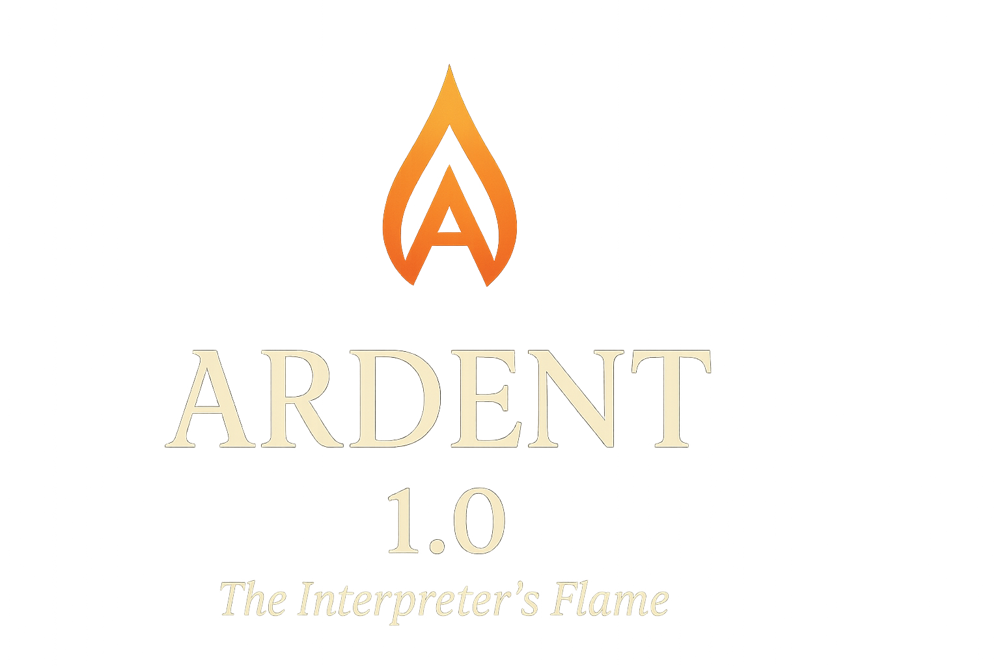

<p align="center">
    
</p>

<h1 align="center">🔥 Ardent 1.0 — <em>The Interpreter’s Flame</em></h1>

<p align="center">
  <b>“Where code becomes poetry, and logic sings in verse.”</b><br><br>
  <i>A poetic programming language that unites literature and computation.</i><br>
  <sub>Crafted with care, elegance, and reason — by Emir Husain</sub>
</p>

---

## 🕯️ Foreword

> “For words are not mere commands,
> but verses that shape the realm of computation.”
>
> Ardent is a programming language written as literature that runs — where spells, scrolls, and truths stand in for functions, modules, and booleans. Syntax is lyrical, semantics are strong, and errors read like narrative.

---

## ✨ Quick Example

```ardent
Let it be proclaimed: "--- The Tale of Ardent ---"

Let it be known throughout the land, a phrase named hero is of "Aragorn".
By decree of the elders, a spell named greet is cast upon a traveler known as name:
    Let it be proclaimed: "Hail, noble " + name + "!"

Invoke the spell greet upon hero

Try:
    Invoke the spirit of math.divide upon 10, 0
Catch the curse as omen:
    Let it be proclaimed: "Caught: " + omen
Finally:
    Let it be proclaimed: "All is well in Middle Code."
```

Output:

```
--- The Tale of Ardent ---
Hail, noble Aragorn !
Caught: A curse was cast: Division by zero in spirit 'math.divide'.
All is well in Middle Code.
```

---

## 🧩 Core Philosophy

| Principle | Meaning |
| --- | --- |
| Poetry‑first Syntax | Code reads as verse — human and timeless. |
| Strong Semantics | Every expression yields a deterministic, type‑safe result. |
| Narrative Errors | Failures appear as poetic “curses.” |
| Lexical Scoping | Each verse obeys its realm. |
| Expandable Spirit | Designed to bridge into native systems and beyond. |

---

## 🪶 Language Overview

| Concept | Ardent Form | Equivalent |
| --- | --- | --- |
| Variable | Let it be known … | var / int / string |
| Function | By decree of the elders … | function / def |
| Loop | Whilst the sun doth rise … | while / for |
| Conditional | Should the fates decree … | if |
| Exception | Try / Catch the curse / Finally | try / catch / finally |
| File I/O | Inscribe upon …, reading from …, Banish … | open/write/read/delete |
| Import | From the scroll of … | import/module |
| Native Bridge | Invoke the spirit of … | FFI / native call |
| Interactive | Oracle | REPL shell |

---

## 🧱 Data Types

| Ardent Type | Keyword | Description | Example |
| --- | --- | --- | --- |
| Number | a number named | Integer value | `Let it be known, a number named age is of 25 winters.` |
| Phrase | a phrase named | String | `Let it be known, a phrase named greet is of "Hail!"` |
| Truth | a truth named | Boolean | `Let it be known, a truth named brave is of True.` |
| Order | an order named | List / Array | `an order named heroes is of ["Aragorn", "Legolas", "Gimli"]` |
| Tome | a tome named | Map / Object | `a tome named hero is of {"name": "Aragorn", "title": "King"}` |

---

## ⚙️ Declarations

```ardent
Let it be known throughout the land, a number named count is of 5 winters.
Let it be known throughout the land, a phrase named greet is of "Hello".
Let it be known throughout the land, a truth named alive is of True.
```

Supports expressions and casting:

```ardent
Let it be known throughout the land, a number named result is of 5 + 3 * 2.
Let it be known throughout the land, a phrase named shout is of cast result as phrase + "!"
```

---

## ⚖️ Conditionals

```ardent
Should the fates decree count surpasseth 5 then
    Let it be proclaimed: "High!"
Else whisper "Low!"
```

Logical expressions:

```ardent
Should the fates decree brave and not weary then
    Let it be proclaimed: "Strong!"
```

Comparisons: `is equal to`, `is not`, `is greater than`, `is lesser than`, `surpasseth`, `remaineth below`

---

## 🔁 Loops

Whilst Loop

```ardent
Let it be known throughout the land, a number named count is of 1 winters.
Whilst the sun doth rise count remaineth below 3 so shall these words be spoken
    Let it be proclaimed: count
    And with each dawn, let count ascend 1
```

For Loop

```ardent
Let it be known throughout the land, a number named i is of 0 winters.
For i remaineth below 3 so shall these words be spoken
    Let it be proclaimed: "Turn " + i
    And with each dawn, let i ascend 1
```

Do‑While Loop

```ardent
Let it be known throughout the land, a number named ct is of 0 winters.
Do as the fates decree so shall these words be spoken
    Let it be proclaimed: "Count is " + ct
    And with each dawn, let ct ascend 1
Until ct surpasseth 3
```

---

## ✨ Spells (Functions)

Definition:

```ardent
By decree of the elders, a spell named greet is cast upon a traveler known as name:
    Let it be proclaimed: "Hail, noble " + name + "!"
```

Invocation:

```ardent
Invoke the spell greet upon "Aragorn"
```

With return value:

```ardent
By decree of the elders, a spell named bless is cast upon a warrior known as name:
    Let it be proclaimed: "Blessing " + name
    And let it return "Blessed " + name
```

---

## 📜 Scrolls (Modules)

```ardent
From the scroll of "heroes.ardent" draw all knowledge.
From the scroll of "spells.ardent" take the spells bless, bestow.
From the scroll of "alchemy.ardent" draw all knowledge as alch.
Unfurl the scroll "legends/warriors.ardent".
```

---

## 🌌 Spirits (Native Bridge)

```ardent
Invoke the spirit of math.add upon 2, 3
Invoke the spirit of system.len upon "abc"
```

Errors read like:

```
The spirits know not the rite 'math.divide'.
The spirits demand 2 offerings for 'math.add', yet 1 was placed.
```

---

## ⚰️ Exception Rites

```ardent
Try:
    Invoke the spirit of math.divide upon 10, 0
Catch the curse as omen:
    Let it be proclaimed: "Caught: " + omen
Finally:
    Let it be proclaimed: "All is well."
```

---

## 🕮 Chronicles (File I/O)

```ardent
Inscribe upon "epic.txt" the words "In the beginning, there was code."
Let it be known throughout the land, a phrase named lines is of reading from "epic.txt".
Etch upon "epic.txt" the words "\nAnd thus Ardent was born."
Banish the scroll "epic.txt".
```

Tip: Run a focused demo via the binary flag:

```
./ardent_demo.exe --chronicles-demo
```

This writes, reads, appends, checks existence, and finally banishes the scroll — all within a sandboxed path policy.

---

## 🔮 Oracle (Interactive REPL)

Start the Oracle:

```powershell
./ardent.exe --oracle
```

Example session:

```
** The Oracle of Ardent **
Speak thy words (or say 'farewell' to depart).

✒️  3 + 2
5
✒️  Let it be known, a number named age is of 18 winters.
Variable assigned: age = 18
✒️  age + 3
21
✒️  farewell
The Oracle falls silent...
```

Notes:
- `_` holds the last result in the REPL.
- Flags: `--color/--no-color`, `--emoji/--no-emoji`, `--poetic` for reflective lines.

---

## 🧠 Implementation Architecture

| Layer | Module | Description |
| --- | --- | --- |
| Lexical Analysis | `lexer.*` | Converts poetic words to tokens |
| Syntactic Analysis | `parser.*` | Builds AST of the verse |
| AST Definitions | `ast.h` | Node types: Expression, Statement, Spell, … |
| Runtime Execution | `interpreter.*` | Evaluates AST, manages scope stack |
| Runtime CLI / REPL | `main.cpp` | Entry point, demos, and Oracle logic |
| Chronicles & Spirits | built‑ins | File I/O rites and native bridges |

---

## 🚀 Phase 1.1 – Lightweight Allocator & Memory Discipline

> Establishing the foundation for performance, predictability, and future language evolution.

### Summary
Phase 1.1 introduces a disciplined memory model centered on a lightweight bump‑pointer arena with scoped frames. All transient language structures now allocate from explicit arenas, eliminating fragmentation and reducing lifetime ambiguity. This sets the stage for future optimization phases without sacrificing the poetic surface of the language.

### Key Advancements
- **Bump Arena + Frames:** Fast linear allocation with `pushFrame()/popFrame()` for precise lifetime control.
- **Phrase SSO:** Small strings stored inline; larger phrases promoted into the active arena — zero heap churn for ephemeral text.
- **Arena‑Backed AST:** All nodes constructed via placement helpers (`node<T>`) eliminating `shared_ptr` overhead.
- **Scoped Environment Stack:** Each scope uses an arena‑allocated hash table; entry lifetimes tied to frames.
- **Immutable Collections:** `Order` (sequential) and `Tome` (key/value) are snapshot structures — stable iteration, copy‑on‑write mutation rites.
- **Copy‑on‑Write Rites:** `expand/remove` (Order) and `amend/erase` (Tome) build fresh snapshots in the active arena; no in‑place mutation.
- **Dual REPL Arenas:** `globalArena_` (persistent) and `lineArena_` (ephemeral) with promotion of “touched” values per input line.
- **Import Lifetime Fix:** Modules parsed/executed in the interpreter’s global arena; no dangling interpreter states.
- **Unified Printing Semantics:** Phrases, Orders, and Tomes render consistently through `formatValue()`; raw phrase output (no extraneous quoting).
- **Test Suite Stability:** All 73 validator cases pass, establishing a correctness baseline.

### Memory Model Overview
| Layer | Purpose |
| --- | --- |
| Global Arena | Long‑lived program/runtime state (persisted values, imported definitions). |
| Line Arena | Ephemeral REPL evaluation workspace reused each input. |
| Frames | Fine‑grained lifetime scoping: pushed for blocks / evaluation phases. |

Allocation Principle: “If it won’t outlive the current evaluation frame, it belongs in the current arena — never on the general heap.”

### Promotion Semantics
During REPL input: `beginLine()` opens a fresh frame on `lineArena_`; any value referenced outside its ephemeral context is marked and later **promoted** into `globalArena_` during `endLine()`. Untouched temporaries are discarded en masse.

### Immutable Collections
Orders and Tomes store flat, arena‑linear memory blocks. Mutation rites allocate new blocks; previous snapshots remain valid for any active readers. This approach prepares future structural sharing or persistent index overlays without API change.

### Contributor Guidelines (Phase 1.1 Discipline)
- Use `activeArena()` for all transient allocations (AST nodes, large phrases, collection snapshots).
- Avoid raw `new/delete`; prefer arena placement helpers.
- Do not mutate an existing Order/Tome in place — always perform a rite that constructs a new snapshot.
- Use `assignVariableAny` for environment updates to ensure scope consistency.
- Keep Phrase concatenation arena‑local; avoid constructing intermediate `std::string` unless required by an external interface.

### Validation Status
All current behavioral tests: `73 passed, 0 failed` — includes literals, collection rites, imports, phrase formatting, and REPL lifecycle.

---

## ⚙️ Phase 1.2 — The Virtual Ember 🔥

“When words take flight as bytecode.”

> “When once mere verse was read by an interpreter,
> now each line burns upon the scroll,
> a spark translated into bytecode,
> and the VM breathes it into life again.”

### Highlights
- Bytecode VM (AVM) with a compact instruction set (arithmetic, logic, comparisons, vars, jumps, print, halt).
- AST → Bytecode compiler for expressions, assignments, prints, and `if/else` with patching.
- Disassembler for human‑readable listings with constants and jump targets.
- `.avm` binary format: save/load compiled chunks for fast start and distribution.
- VM Execution Mode: compile source and run directly via `--vm`.
- REPL Hot‑Reload: `--vm-repl` compiles each line and preserves globals in the live VM.

### Quick Usage
- Compile and run a scroll in the VM:
    - `./ardent_vm.exe --vm path/to/scroll.ardent`
- Disassemble a scroll or an existing `.avm`:
    - `./ardent_vm.exe --disassemble path/to/scroll.ardent`
    - `./ardent_vm.exe --disassemble demo.avm`
- Save compiled bytecode to `.avm`:
    - `./ardent_vm.exe --disassemble --save-avm demo.avm path/to/scroll.ardent`
- Run a prebuilt `.avm`:
    - `./ardent_vm.exe --vm demo.avm`
- AVM REPL (hot‑reload globals):
    - `./ardent_vm.exe --vm-repl`

### AVM Components
- `opcode.h`: Instruction set (`OP_PUSH_CONST`, `OP_LOAD/STORE`, `OP_ADD/SUB/MUL/DIV`, `OP_AND/OR/NOT`, `OP_EQ/NE/GT/LT/GE/LE`, `OP_JMP/JMP_IF_FALSE`, `OP_PRINT`, `OP_HALT`).
- `bytecode.h`: `Chunk`, `BytecodeEmitter`, and `.avm` save/load helpers.
- `vm.h`: Stack interpreter, flat slot variables, relative jumps, phrase and numeric semantics.
- `compiler_avm.h`: AST traversal, constant pool, slot symbols, and jump patching.
- `disassembler.h`: Mnemonic listing with constants and resolved targets.

### Notes
- REPL retains globals by persisting VM slots; each line compiles with a fresh emitter to avoid code accumulation.
- `.avm` format: `AVM1` magic, typed constants (int/string/bool), code bytes — stable for simple sharing.
- This phase prioritizes visibility and portability of execution; loops, spells, and collections in AVM are slated next.

---

## 🪄 Ardent 1.3 — “The Scholar’s Ink”

When the poet’s craft becomes a scholar’s tool.

### What’s New
- Unified CLI launcher with clear modes and tooling.
- Scroll Loader for logical imports with sensible roots.
- Utility flags for developer workflows and demos.
- Packaging and install scripts for system-style layouts.

### Unified CLI
- `--version` prints version banner and build info.
- `--interpret <file>` runs the classic interpreter.
- `--compile -o out.avm <file>` emits AVM bytecode.
- `--vm <file|.avm>` compiles or loads and runs on the VM.
- `--repl` / `--oracle` starts an interactive REPL.
- `--disassemble <file|.avm>` shows a mnemonic listing.
- `--bench` runs micro-benchmarks with readable timing.
- `--lint` warns on simple style/structure issues.
- `--pretty` formats scrolls to a canonical layout (stub).
- `--no-optimize` disables the 2.1 optimizer (constant folding / purity analysis / partial evaluation).
- `--banner` prints a clean banner (screenshot-friendly).
- `--scrolls` lists available stdlib scrolls.

---

## 🌿 Ardent 1.4 — “Whispering Scrolls”

> When standard scrolls whisper across the realm and the tools grow wise.

### What’s New
- Standard Scrolls library in `scrolls/`: `chronicles`, `truths`, `numbers`, `alchemy`, `time`, `echoes` — all written in Ardent and importable.
- Poetic, ANSI‑colored tracebacks with highlighted strings/variables and call stack display.
- REPL (Oracle) boosts: history, multiline input, basic autocomplete, and refined output.
- Pretty printer: `--pretty <file>` formats to canonical style.
- Scroll loader enhancements: hierarchical roots, relative/tilde imports, version token parsing (`name@ver`), and caching.
- Diagnostics: `--lint` (unused vars/spells, unreachable code, “is of is of” redundancy).
- Benchmarking: `--bench` reports execution time and memory (AST + runtime arenas).
- Prologue metadata: optional header stored for tooling (`Title`, `Version`, `Author`, extras).

### Quick Pretty/Lint/Bench
```powershell
./ardent.exe --pretty examples/blessing_and_return.ardent
./ardent.exe --lint examples/blessing_and_return.ardent
./ardent.exe --bench examples/blessing_and_return.ardent
```
- `--demo` runs a short poetic showcase.

### Scroll Loader (Stdlib Autoload)
- Search roots (fallback order):
    - `./scrolls/`
    - `$ARDENT_HOME/scrolls/`
    - `/usr/local/lib/ardent/scrolls/` (Windows equivalent under `%ProgramFiles%\Ardent\scrolls`)
- Logical imports like `From the scroll of "chronicles"…` resolve without explicit paths.
- Friendly errors for missing scrolls.
- Bytecode preference planned: load `.avm` when present alongside source.

### Packaging & Install
- CMake install target places:
    - `bin/ardent`, `bin/ardentc`, `bin/oracle`
    - `lib/ardent/scrolls/`
    - `share/ardent/examples/`
- Scripts: `install.sh` (Unix/macOS) and `install.bat` (Windows).
- Installer message: “The Scholar’s Ink now flows through your system.”

### Versioning
- Embedded macros (see `src/version.h`):
    - `ARDENT_VERSION`, `ARDENT_CODENAME`, `ARDENT_BUILD_DATE`, `ARDENT_BUILD_HASH`.
- Shown in `--version`, `--banner`, and installer output.

### Quick Start
- Run the demo:
    - `./ardent_vm.exe --demo`
- List stdlib scrolls:
    - `./ardent_vm.exe --scrolls`
- Compile to AVM and run:
    - `./ardent_vm.exe --compile -o saga.avm saga.ardent`
    - `./ardent_vm.exe --vm saga.avm`

### Notes
- REPL hot-reload (from 1.2) persists globals; CLI now exposes `--repl`.
- Pretty-printer and linter are minimal stubs intended for iterative refinement.

---

## ⚒️ Ardent 2.0 — The Forge of Fate

> Where verse becomes metal. Where spells are tempered into IR, and scrolls are forged into native steel.

This phase introduces a complete LLVM-based toolchain alongside the classic interpreter and VM. You can now generate LLVM IR, JIT-execute it with ORC v2, or AOT-compile to native executables.

### What’s Implemented

- **AST → LLVM IR generation:** Fully implemented in `src/irgen/compiler_ir.cpp` (module + function lowering, values, calls, control flow).
- **JIT execution (ORC v2):** Working and stable; verified outputs; proper symbol resolution; ABI-stable runtime calls.
- **AOT compilation (.obj → .exe / .so):** LLVM emits object files via `TargetMachine`. Windows native EXE generation works end-to-end. Entry shim + runtime linked; final EXE successfully runs Ardent code.
- **ArdentValue ABI & lowering rules:** Struct layout finalized; constructors for boolean/phrase/number correct; validated under JIT and AOT.
- **Type inference for numeric ops:** Fast paths for +, -, * with safe dynamic fallback.
- **Spell calls → direct LLVM calls:** Spell declarations lower to `spell_<name>` functions; calls inline cleanly where possible.
- **Control flow lowering (if/else/while):** Completed with valid block structure; verified across multiple tests.
- **Debug symbols / readable IR:** `--emit-llvm` emits readable IR for inspection and debugging; line info optional.

### New CLI Flags (LLVM Tooling)

- `--emit-llvm <scroll>`: Emit LLVM IR (`.ll`) next to the source.
- `--emit-o <scroll> -o out.obj`: Emit an object file for the host target.
- `--aot <scroll> -o out.exe`: AOT-compile to a native executable (Windows shown; `.so/.dylib` next).
- `--target <triple>`: Override target triple for cross-compilation experiments.

Example on Windows (MinGW toolchain present):

```powershell
# Emit human-readable LLVM IR
./build/ardent.exe --emit-llvm test_scrolls/numbers_test.ardent

# Forge native executable (produces numbers_native.exe)
./build/ardent.exe --aot test_scrolls/numbers_test.ardent -o numbers_native.exe
./numbers_native.exe
```

Notes:
- On Windows Ardent prefers MinGW `g++` to link with the static runtime; if unavailable, it falls back to `lld-link` (requires proper Windows SDK/MSVC `LIB` paths).
- Runtime debug prints can be silenced later; they’re helpful while validating the AOT pipeline.

---

## 🌠 Ardent 2.1 — Optimizing Embers

> A semantic pass over the flame: faster scrolls, same truths.

This release adds a safe, default-on optimizer pipeline for the classic interpreter / VM compile path.

### What’s Implemented

- **AST Constant Folding:** Compile-time folding of numeric/boolean/string expressions.
- **Pure Spell Detection:** A conservative purity analysis that marks spells pure when they perform no I/O, no chronicle effects, and only call other pure spells.
- **Partial Evaluation:** If a pure spell is invoked with constant arguments, the invocation can be evaluated at compile time and replaced with a literal.
- **Cached Dispatch (VM):** A lightweight call-site cache for `CALL` to reduce repeated dynamic dispatch overhead.

### Control Flag

- `--no-optimize` / `--no-opt`: Disable the optimizer pipeline (useful for debugging or bisecting behavior).

### Release Notes


---

## 🪞 Closing Words

> "Where others see syntax, we see verse.
> Where others run code, we recite creation."

Ardent – A bridge between artistry and algorithm.
A whisper to all who believe code can be beautiful.

<p align="center">
    <br>
    <b>Ardent — The Language of Poetic Code</b><br>
    <sub>© 2025 Emir Husain. All rights reserved.</sub>
</p>
